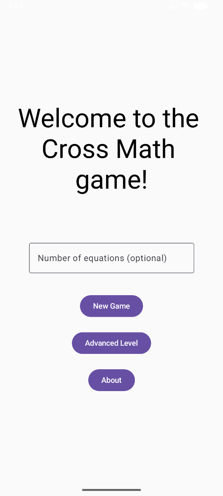
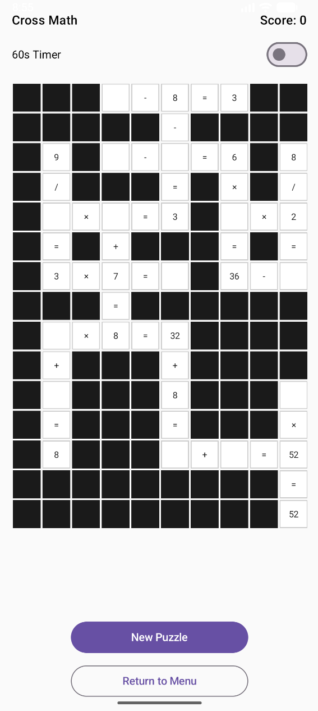
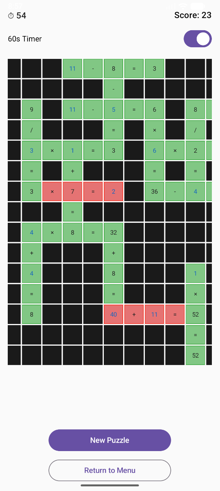
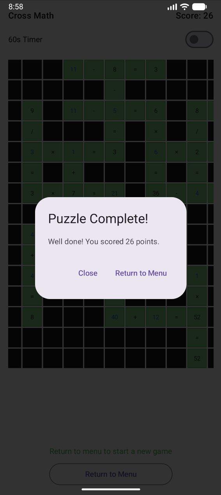
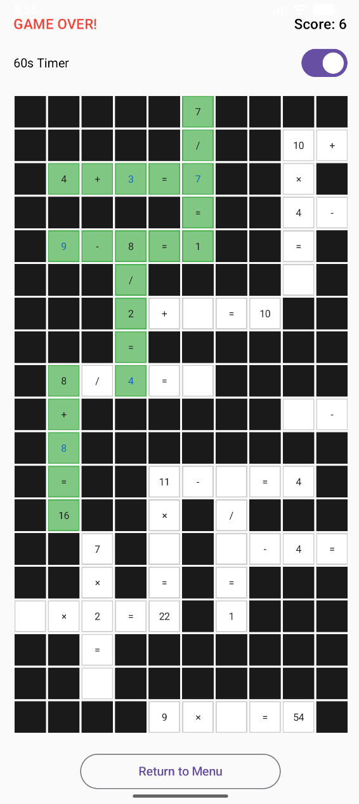

# CrossMath 🧮

A cross-math puzzle game for Android built with **Jetpack Compose** and **Kotlin**.

Fill in the blank cells so every equation — across and down — is correct. Think crossword, but with arithmetic.

---

## 📱 Screenshots

| Home Screen | About | New Game |
|---|---|---|
|  |  |  |

| Filled Example | Completed Puzzle | Game Over |
|---|---|---|
|  |  |  |

---

## ✨ Features

- **Dynamic puzzle generation** — grids between 11×11 and 20×20 with random equation placement
- **Intersecting equations** — horizontal and vertical equations cross at shared cells, Sudoku-style
- **Three blank types** — missing left operand, right operand, or result
- **Real-time validation** — cells turn green/red instantly as you fill them in
- **Score tracking** — 1 point per equation correctly solved
- **60-second timer** — optional countdown mode with GAME OVER state
- **Custom equation count** — set how many equations you want before starting
- **Portrait & landscape support** — fully adaptive layout for both orientations
- **Rotation-safe** — timer, progress, and puzzle all survive device rotation (`ViewModel` + `rememberSaveable`)

---

## 🏗️ Architecture

```
app/
└── com.example.crossmath/
    ├── MainActivity.kt        # Start screen — equation count input, navigation
    ├── GameScreen.kt          # Game UI — grid, timer, score, number pad
    ├── PuzzleViewModel.kt     # State holder — survives rotation
    ├── PuzzleGenerator.kt     # Puzzle creation algorithm
    ├── PuzzleValidator.kt     # Equation evaluation (CORRECT / INCORRECT / INCOMPLETE)
    ├── Puzzle.kt              # Data models — PuzzleCell, Puzzle, CellType
    └── AdvancedLevel.kt       # Placeholder for Advanced Level
```

### Key design decisions

| Decision | Why |
|---|---|
| `ViewModel` for puzzle state | Survives configuration changes (rotation) without re-generating the puzzle |
| `rememberSaveable` for UI state | Timer, game-over flag, and selected cell persist across rotation |
| `evaluateEquation` on every input change | Drives green/red highlighting reactively without manual triggers |
| 85/15 intersecting vs random placement | Produces denser, more interesting crossword-style grids |
| `BoxWithConstraints` for cell sizing | Cells scale responsively to available screen width |

---

## 🛠️ Built With

- [Kotlin](https://kotlinlang.org/)
- [Jetpack Compose](https://developer.android.com/jetpack/compose) — no XML Views
- [ViewModel](https://developer.android.com/topic/libraries/architecture/viewmodel) — Lifecycle-aware state
- [Coroutines](https://kotlinlang.org/docs/coroutines-overview.html) — `LaunchedEffect` countdown timer
- Android Studio Hedgehog+

---

## 🚀 Getting Started

1. Clone the repo:
   ```bash
   git clone https://github.com/ajxlf/Cross-Math.git
   ```
2. Open in **Android Studio**
3. Run on an emulator or device with **API 26+**

No API keys or external dependencies needed — fully self-contained.

---

## 📐 How the Puzzle Generator Works

1. Pick a random grid size (11–20 rows × columns)
2. Place the first equation at a random position and direction
3. For each subsequent equation, **85% of the time** try to intersect an existing equation at a number cell — this creates the crossword-style grid
4. Validate each candidate with `isCompatible()` — checks for adjacent equations, illegal overlaps, and mismatched shared values
5. Retry up to 20 times if placement fails; fall back to a smaller default if all attempts fail
6. One cell per equation is left blank (randomly: left operand, right operand, or result)

---

## 🎓 Academic Context

Built as a coursework project for **5COSC023W Mobile Application Development** at the University of Westminster.

---

## 📄 Licence

This project is for portfolio and educational purposes. Not licensed for redistribution.
